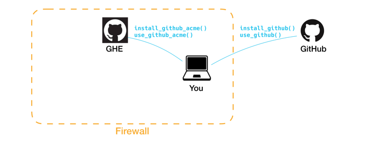

```{r echo = FALSE}
knitr::opts_chunk$set(eval = FALSE)
```

The goal of this vignette is to show how you can use **ghentr** to make functions like `install_github()` for an institution-specific package to work with your instance of GitHub Enterprise. 

Let's assume you work at [Acme Corporation](https://en.wikipedia.org/wiki/Acme_Corporation) and that Acme has an instance of GitHub Enterprise (GHE) behind its firewall. You would like to use your GHE as easily as you use GitHub, where you can use `devtools::install_github()` and `usethis::use_github()`.



One way to do this is to create a package, perhaps called **acmetools**. In this package you can create analogous functions that you could use to access your GHE, as demonstrated in the figure above. You can create these functions using `use_github_enterprise()`.

## Usage

### Create a package

If you don't already have an institution-specific package, this is your invitation to create one.

```{r}
# You may want to call your package something different,
# as well as specify a different path on your computer.
usethis::create_package("~/r-packages/acmetools")
```

At this point, if you are using the RStudio IDE, a new RStudio project will open. Your subsquent work will be in this newly-created project which.

### Create functions

Before proceeding, you will need three pieces of information:

- the `host` endpoint of your GHE instance - it might be something like `"github.acme-corp.com/api/v3"`.

- a `suffix` to use for function names - this puts the `"acme"` into `use_github_acme()`.

- a longer `name` that will be put into your functions' documentation, such as `"Acme Corporation"`.

With this, you are ready to create your functions:

```{r}
ghentr::use_github_enterprise(
  host = "github.acme-corp.com/api/v3",
  suffix = "acme",
  name = "Acme Corporation"
)
```

This will create three `R` files:

- `utils-use_ghe.R`, containing `use_github_acme()`

- `utils-install_ghe.R`, containing `install_github_acme()`

- `utils-ghe_pat.R`, containing `github_acme_pat()`

As well, this will copy some text to your computer's clipboard, which may be useful to add to **acmetools**' `README`.

Finally, some packages are added to the `Imports` field of **acmetools** `DESCRIPTION` file: **usethis** and **devtools**.

### Followup

Using the information you provided, ghentr writes out fully-documented functions in your newly-created files. You may wish to amend the documentation, then run `devtools::document()` when you are done.

As you know, `devtools::install_github()` uses a GitHub Personal Access Token (PAT), normally stored in an environment variable named GITHUB_PAT. Similarly, your function acmetools::install_github_acme() will look for an environment variable named GITHUB_ACME_PAT. 

Accordingly, you (and anyone who would use **acmetools**) should get a PAT from the Acme GHE, then add it to your `.Renviron` file:

```
GITHUB_ACME_PAT="acme-pat-goes-here"
```

Similarly, you may wish to add **acmetools** to the packages loaded when you start an interactive session, by adding to your `.Rprofile`:

```
if (interactive()) {
  suppressMessages(require("devtools"))
  suppressMessages(require("acmetools"))
}
```

To distribute the **acmetools** package, you can suggest that people use `devtools::install_github()`:

```{r}
# install.packages("devtools")
devtools::install_github("<your-account-here>/acmetools", host = "github.acme-corp.com/api/v3")
```

Once they have **acmetools**, they can use `acmetools::install_github_acme()` instead.

Alternatively, you could set up a CRAN-like repository using the **drat** package, then deploy it to be served from Acme's GHE. Then, with a strightforward modification to your (or any of your Acme colleages') `.Rprofile`, you could use `install.packages("acmetools")`. This is the subject of this package's [repository vignette](using_repository.html).  

## Behind the scenes

The functions created by `use_github_enterprise()` are wrappers to (or mimic) existing **usethis** and **devtools** functions.

Here is the code for `acmetools::install_github_acme()`:

```{r}
install_github_acme <- function(repo,
                                username = NULL,
                                ref = "master",
                                subdir = NULL,
                                auth_token = github_acme_pat(quiet),
                                host = "github.acme-corp.com/api/v3",
                                quiet = FALSE,
                                ...){
  devtools::install_github(
    repo,
    username = username,
    ref = ref,
    subdir = subdir,
    auth_token = auth_token,
    host = host,
    quiet = quiet,
    ...
  )
}
```

As you can see, this function calls `devtools::install_github()` while changing argument-defaults to conform to Acme's GHE.

The same idea is used in `acmetools::use_github()`:

```{r}
use_github_acme <- function(organisation = NULL,
                            private = FALSE,
                            protocol = c("ssh", "https"),
                            credentials = NULL,
                            auth_token = github_acme_pat(),
                            host = "https://github.acme-corp.com/api/v3") {

  usethis::use_github(
    organisation = organisation,
    private = private,
    protocol = protocol,
    credentials = credentials,
    auth_token = auth_token,
    host = host
  )
}
```

Finally, `acmetools::github_acme_pat()` mimics `devtools::github_pat()`:

```{r}
github_acme_pat <- function(quiet = FALSE) {

  pat <- Sys.getenv("GITHUB_ACME_PAT")
  if (nzchar(pat)) {
    if (!quiet) {
      message("Using GitHub PAT from envvar GITHUB_ACME_PAT")
    }
    return(pat)
  }
}
```

