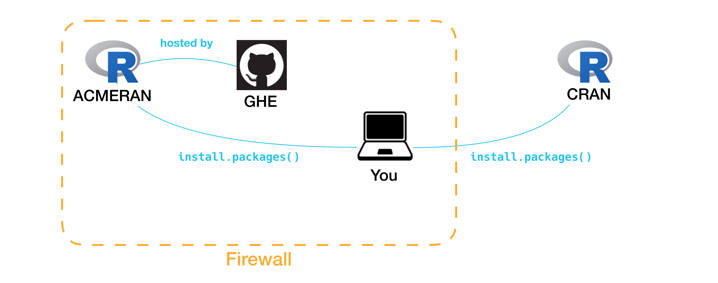
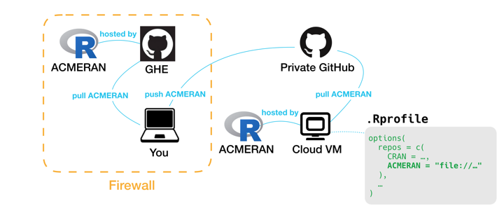

```{r echo = FALSE}
knitr::opts_chunk$set(eval = FALSE)
```

The goal of this vignette is to show how to create and use a CRAN-like repository deployed to Github Enterprise (GHE). The idea is to use the Drat Repository Archive Template via the [drat](https://CRAN.R-project.org/package=drat) package, by Dirk Eddelbuettel et al. 

Continuing the use-case of the [GitHub Enterprise vignette](using_ghe.html), let's assume you work at [Acme Corporation](https://en.wikipedia.org/wiki/Acme_Corporation) and that Acme has an instance of GitHub Enterprise (GHE) behind its firewall. You would like to create a CRAN-like repository so that you and your colleagues can install packages from a private repository just as easily as you install packages from CRAN.



Let's assume that your CRAN-like repository is named ACMERAN. Once you have established your repository and populated it with packages, anyone within your firewall can `install.packages()` from the repository by adding a line to their `.Rprofile` file. As the adminstrator, you will need to determine your particular URL and publicize it:

```{r}
options(
  repos = c(
    CRAN = "https://cran.rstudio.com/",
    ACMERAN = "https://pages.github.acme-corp.com/ACME-R/ACMERAN/" # add a line like this
  ),
  ...
)
```

The remainder of this vignette focuses on how to create and populate a CRAN-like repository like ACMERAN.

## Usage

For a fuller treatment of this material, please read this **drat** [vignette for package authors](https://cran.r-project.org/web/packages/drat/vignettes/DratForPackageAuthors.html). The original purpose of **drat** was to make personal repositories publically available on `github.com`. 
For private use within an institution, I recommend a slightly different approach, hence this vignette. 

### Creating a repository

A CRAN-like repository is a filesystem made available via a URL, like `"https://cran.rstudio.com"`. If you are installing from source (as opposed to binaries), this filesystem need have only a directory named `src/contrib`.

To start this process, create a new project on your computer:

```{r}
usethis::create_project("path/to/ACMERAN")
```

If you are using the RStudio IDE, a new session will open for this project; continue your work there. 

Your next step is to create the filesystem. A convenience function is provided, `init_drat_repo()`:

```{r}
ghentr::init_drat_repo()
```

You will be encouraged to set an option in your `.Rprofile`:

```{r}
options(
  dratRepo = "path/to/ACMERAN",
  ...
)
```

As the ACMERAN adminstrator, it is useful for you to set your `dratRepo` option; this makes it easier for you to add a package to your repository, as **drat** will know where to look.

Next, you should create a git repository for your project. Here is where I suggest doing something differently from what **drat** suggests. If you were to use the `drat::initRepo()` function, it would create a git repository and a `gh-pages` branch. I suggest that you use the `master` branch because it will require you to act explicitly to share the git repository as a web-site; more on this later.

```{r}
usethis::use_git()
```

To put this repository onto your (Acme's) instance of GHE, you can use your `acmetools::use_github_acme()` function, as described in the [using GitHub Enterprise vignette](using_ghe.html).

```{r}
acmetools::use_github_acme()
```

Finally, go to your repository's page at your GHE website, go to its "Settings" tab, and activate "GitHub Pages" on the master branch.

At this point, you have a fully-functioning CRAN-like repository. You can publicize the URL to your colleagues to add to their `options("repos")`. However, for the repository to be useful it needs packages.

### Adding packages to repository

Let's say you have a package called **boomerang**, and it is ready to add to the ACMERAN repository. We will assume that the package-project for **boomerang** is on your computer (having cloned it, if needed), and that your `option("dratRepo")` is set properly. 

Start by opening the **boomerang** project in your RStudio IDE, ensuring your working directory is the project's root direcory.

In a package's `DESCRIPTION` file, there may a field called `Repository`. You may not have noticed it before now because it is added by the CRAN mainatiners. This field is needed by **packrat** or **rsconnect**, so that they know where to find the source for a particular package. As the adminstrator for ACMERAN, this is your job to make sure this field is correct for all the packages added to ACMERAN. 

The **ghentr** package offers a couple of functions to set the `Repository` field in your new package's `DESCRIPTION`. For ACMETOOLS, if `getOption("dratRepo")` is set, and its `basename()` is `"ACMETOOLS"` or `"acmetools"`, then you can use the `use_drat_repo()` function. If not, you can use the `use_repo()` function.

```{r}
basename(getOption("dratRepo")) # check to see if "equivalent" to repository name
```

From the somewhere in the package directory for **boomerang**, you can run:

```{r}
# use one of these

# yes - name is equivalent
ghentr::use_drat_repo()

# no - name is not eqivalent
ghentr::use_repo("ACMETOOLS")
```

This will add the field `"Repository: ACMETOOLS"` to **boomerang**'s DESCRIPTION file.

Next, check and build the package:

```{r}
devtools::check() 
devtools::build()
```

The `build()` function, if successful, returns a string describing the path to package file:

```
[1] "path/to/boomerang.tar.gz"
```

Now that you have this file, you can use **drat** to add it to your repository. The function `drat::insertPackage()` uses `getOption("dratRepo")` as its default location for the drat repository.

```{r}
drat::insertPackage("path/to/boomerang.tar.gz")
```

When you commit and push your ACMETOOLS project to Acme's GHE, the **boomerang** package will be available to anyone who has identified the ACMETOOLS repository, by using `install.packages("boomerang")`.

### Source repository

One note, in my experience it may occasionally be necessary to install packages using the `type` option, `install.packages("boomerang", type = "source")`. As **drat** explains, its purpose is to help you create a source repository, as opposed to a binary repository. As a result, if you add pacakages to ACMERAN that require compilation, either you will have to add the binaries yourself, or let your users know that they will need the appropriate compilation-environment, e.g. [Rtools](https://cran.r-project.org/bin/windows/Rtools/) for Windows.

If you want to provide binaries, this is possible, but this goes beyond the scope of **ghentr** and **drat**.

### Using repository externally

Within your institution, you may want to install packages from your private repository, ACMERAN, on a virtual machine (or other such computer) outside your firewall. This section will walk you through how to do that from a technical point-of-view. Of course, you should check with your management to see if this solution is permissable as a matter of policy.



The first thing is to think of ACMERAN as being a **git** repository. From your computer's point-of-view, within the firewall, you can have a remote that points to your instance of GHE. You can also have a remote that points to a private repository at `github.com`.

From inside the firewall, you could pull the ACMERAN repository from your GHE, then push it to (private) `github.com`. This is the reason why I recommend that you serve GitHub pages from the `master` branch, rather than from the `gh-pages` branch. By using the `master` branch, `github.com` does not automatically make the repository available on GitHub pages. If you used a `gh-pages` branch, this would be served automatically, which may not be what you want to do with a set of private packages.

From your resource outside the firewall, you could then pull the repository from `github.com` to a directory on that resource. Also on that resource, you could amend an `.Rprofile` file (or `.Rprofile.site`). Keep in mind that the URL that you provide for a package repository can be a `file://` URL on your remote resource.

```{r}
options(
  repos = c(
    CRAN = "https://cran.rstudio.com/",
    ACMERAN = "file://path/to/ACMERAN/" 
  ),
  ...
)
```

With this in place, you can `install.packages()` from ACMERAN on your remote resource.

It occurs to me that this may be a use-case for Docker. However, I have to confess to not having used Docker - so I am in no position to recommend it (or not).

