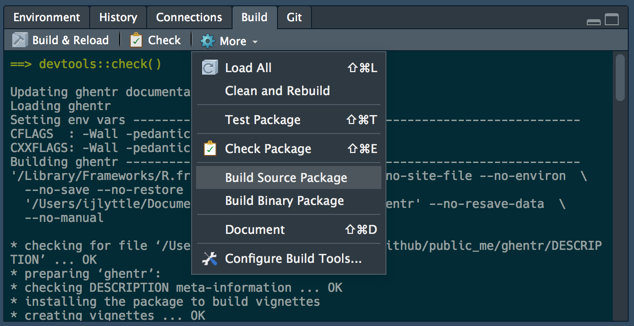
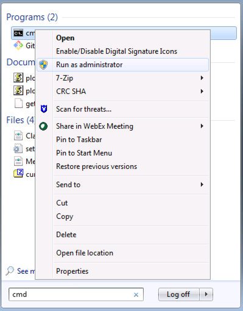

In the initial shakedown of this package, my colleague Emily Bosak and I found some glitches.

## Too many repos

### Glitch

If you are using **devtools** 1.13.4, and if your collection of repositories is too long, `devtools::build()` runs into a problem. The error looks like this:

```
'/Library/Frameworks/R.framework/Resources/bin/R' --no-site-file --no-environ --no-save --no-restore  \
  --quiet CMD build '/Users/ijlyttle/Documents/git/github/public_me/ghentr' --no-resave-data  \
  --no-manual 

Error: 4:3: unexpected symbol
3: "https://pages.github.schneider-electric.com/SE-AAP-R/SERAN2/"
4:   ...
     ^
Execution halted
Error: Command failed (1)
```

### Workarounds

As suggested in the response to this [issue](https://github.com/hadley/devtools/issues/1695), if you use `pkgbuild::build()`, used in the development version of **devtools** (as of early 2018), this problem goes away.

Another way to build the source package is to follow the "Build" > "More"  > "Build Source Package" sequence in the RStudio IDE: 



<br>

At the end of the process, the string you need for `drat::insertPackage()` will be printed to that window.

## Windows 7 and SSH

Frustratingly, this glitch can be as many as three separate glitches.

### Glitch

This is an issue we have seen on Windows 7 - we were not able to test on any other versions of Windows so this may or may not be the case in Windows 10.

This appears when using `usethis::use_github()` or local variation of it, using SSH for the git remotes.

One of the functions that `usethis::use_github()` relies on is `git2r::push()` - the `credentials` argument to `use_github()` is passed to `push()`. If its value is `NULL` (the default), then `push()` will pass the request for credentials to an ssh-agent. I find that this works well on Mac, but I am having trouble to establish an ssh-agent on Windows that can make itself known to **git2r**.

Thus, when we tried this:

```R
use_github()
```

We got this:

```
...
✔ Creating GitHub repository
✔ Adding GitHub remote
✔ Pushing to GitHub and setting remote tracking branch
Error in .local(object, ...) : 
  Error in 'git2r_push': error authenticating: failed connecting agent
```

### Workaround
 
Luckily, there is an alternative: if `use_github()` cannot use the ssh-agent, we can supply the credentials argument:

```R
use_github(credentials = git2r::cred_ssh_key())
```

### Glitch

If you created your keys using the RStudio IDE, it will put them in `"C:/Users/username/.ssh"`.

The function `git2r::cred_ssh_key()` looks for your keys in the directory `"~/.ssh"`. On Windows, this may be problematic. When we type `path.expand("~")`, we get `"C:/Users/username/Documents"`. This means that `git2r::cred_ssh_key()` looks for our keys in `"C:/Users/username/Documents/.ssh"`; they aren't there!

### Workaround

We solved this problem by creating a symbolic directory-link so that we need keep only one set of keys. Following the Windows "Start" button, we opened the command line, using "Run as administrator".



<br>

At this Windows command line, we created the symbolic directory-link:

```
MKLINK /D "C:\Users\username\Documents\.ssh" "C:\Users\username\.ssh"
```

Now `git2r::push()` can find your keys.

### Glitch

If your key is protected by a passphrase (it is, right?), `git2r::push()` needs your help to get it. 

### Workaround

If the package **getPass** is installed, then `git2r::push()` will launch a popup where you can enter your (obscured) passphrase. 

```
install.packages("getPass")
```

At this point, you should be able to use SSH keys on Windows without difficulty.

```R
use_github(credentials = git2r::cred_ssh_key())
```


